# Solucion al Lab 05 de ARSW Lab – React Client for Blueprints (Redux + Axios + JWT)
## Integrantes: 
1. Juan Camilo Torres Suarez 
2. Valeria Bermudez Aguilar 
### 1. Canvas
Se implementó el componente `BlueprintCanvas` con las siguientes características:
- Identificador propio configurable (`id="canvas-blueprint"`).
- Dimensiones controladas ($520 \times 360$ px) con estilos adaptables.
- Integración en `BlueprintsPage.jsx` dentro del layout principal.
- Validación de contexto 2D (`if (!ctx) return`) para robustez ante entornos de prueba.

#### Evidencias:

**1. Renderizado en el navegador e inspección DOM:**
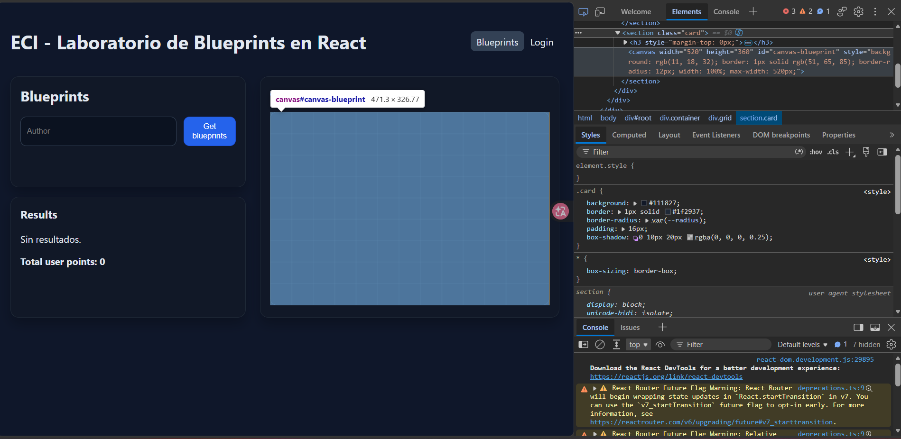

**2. Código del componente:**

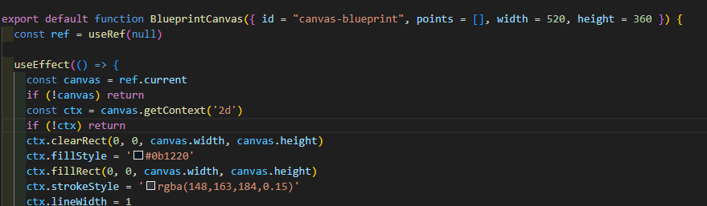

**3. Código de la Pagina Canvas:**

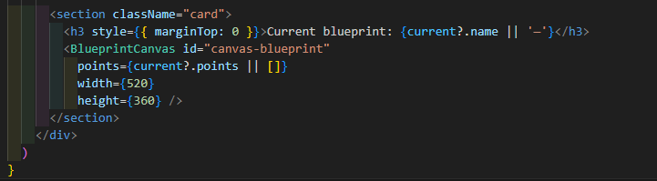

**4. Prueba unitaria en verde (Vitest):**

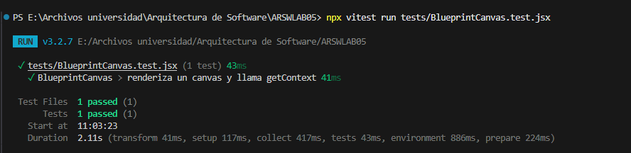

### 2. Listar los planos de un autor 

Se implementó la funcionalidad de búsqueda y listado de planos con las siguientes características:
- Entrada de texto para ingresar el nombre de un autor (`authorInput`).
- Se realizo la acción asíncrona `fetchByAuthor` hacia el  Redux  al pulsar el botón "Get blueprints".
- Renderizado de la tabla con las columnas: **Blueprint name**, **Number of points** y botón **Open**.
- Cálculo optimizado mediante `useMemo` y `.reduce()` para sumar y mostrar el total acumulado de puntos del autor (`totalPoints`).
- Manejo de estados condicionales para carga y mensajes cuando no hay resultados.

#### Evidencias:

**1. Interfaz de búsqueda y resultados en el navegador:**

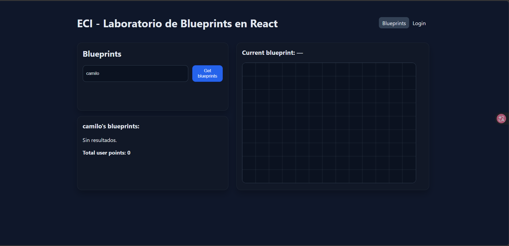

**2. Código de la lógica de búsqueda, cálculo de puntos y tabla:**

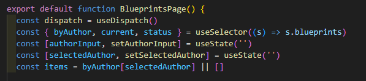

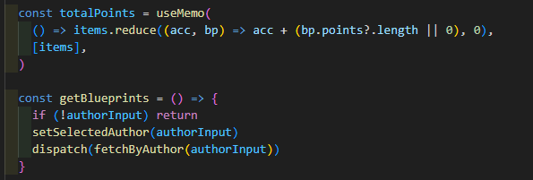

**3. Prueba unitaria en verde (Vitest):**

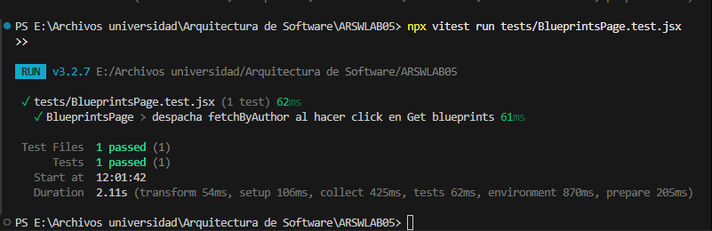

### 3. Seleccionar un plano y graficarlo 

Se implementó la selección y representación gráfica interactiva de planos con las siguientes características:
- Botón **Open** en cada fila de la tabla que despacha la acción `fetchBlueprint` hacia el  Redux. 
- Actualización reactiva del título en la sección derecha para reflejar el plano seleccionado (`Current blueprint: [nombre]`).
- Algoritmo de renderizado en Canvas 2D (`BlueprintCanvas.jsx`):
  - Conexión de puntos mediante segmentos de recta consecutivos con `ctx.moveTo()` y `ctx.lineTo()`.
  - Marcado visual de vértices mediante arcos circulares con `ctx.arc()`.
  - Limpieza automática del lienzo (`ctx.clearRect()`) antes de dibujar cada nuevo plano.
- Solución de accesibilidad en formularios (`htmlFor` e `id`) y soporte para entornos de prueba.

#### Evidencias:

**1. Código del algoritmo de dibujo en el Canvas :**

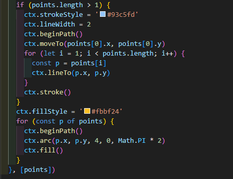

**2. Código de la función Open y título dinámico en BlueprintsPage:**

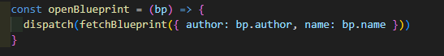

**3. Ejecución total de pruebas en verde:**

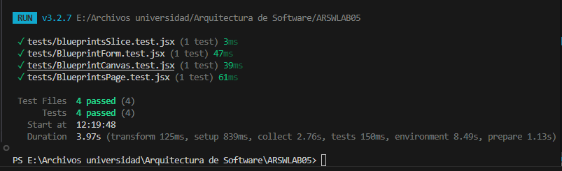

### 4. Servicios `apimock` y `apiclient`

Los dos servicios exponen la misma interfaz (`getAll`, `getByAuthor`, `getByAuthorAndName`, `create`, `update`, `remove`):

- `apimock.js` guarda los blueprints en un arreglo en memoria y simula los errores HTTP (404, 409) que devolvería un backend real.
- `apiClient.js` pega contra el backend real con Axios, desenvuelve la respuesta (funciona tanto si llega el array directo como si viene envuelto en `{ code, message, data }`) y marca como `unsupported` las rutas que el LAB04 no tiene.
- `blueprintsService.js` elige uno u otro según `VITE_USE_MOCK`, así que cambiar de mock a real es solo tocar el `.env`:

```env
VITE_USE_MOCK=true   # mock en memoria
VITE_USE_MOCK=false  # apiClient.js contra el backend real
```

Más abajo, en "Limitaciones del backend del LAB04", está el porqué seguimos usando el mock.

#### Evidencias:

**1. Código de `blueprintsService.js` (switch mock/real por variable de entorno):**

<!-- Captura pendiente 1: captura de src/services/blueprintsService.js -->

**2. `.env`/`.env.example` con `VITE_USE_MOCK` y prueba de `blueprintsService.test.js` en verde:**

<!-- Captura pendiente 2: captura del archivo .env.example y de la consola con `npx vitest run tests/blueprintsService.test.js` en verde -->

### 5. Interfaz con React

El blueprint abierto, la lista por autor y el catálogo completo viven en el store de Redux, no en variables sueltas ni en el DOM. Los componentes leen ese estado con `useSelector` y lo cambian despachando thunks; no hay `document.getElementById` ni nada por el estilo (la única excepción es el propio `canvas`, porque dibujar ahí implica tocar el elemento directamente, es como funciona la API de Canvas). El nombre y los puntos del plano que se ve en edición son estado local de UI sincronizado con lo que hay en Redux, no una copia manual.

#### Evidencias:

**1. Código del slice mostrando el estado global `current`/`byAuthor`/`all`:**

<!-- Captura pendiente 3: captura de src/features/blueprints/blueprintsSlice.js (initialState + extraReducers de fetchBlueprint) -->

**2. Código de `BlueprintsPage.jsx` leyendo ese estado con `useSelector` (sin acceso directo al DOM):**

<!-- Captura pendiente 4: captura de la sección de BlueprintsPage.jsx donde se hace `useSelector((s) => s.blueprints)` -->

### 6. Estilos

CSS propio en `styles.css`, sin Bootstrap ni nada externo: tema oscuro, tarjetas, botones, tabla y unos badges para los distintos estados (error, cambios sin guardar, modo actual). El layout es responsive (en pantallas angostas `page-grid` pasa de dos columnas a una) y la columna de acciones de la tabla quedó compacta para no partirse en dos líneas — más sobre eso en "Modos de lectura y edición".

#### Evidencias:

**1. Captura de la UI en el navegador (tarjetas, tabla, select, canvas y botones con los estilos aplicados):**

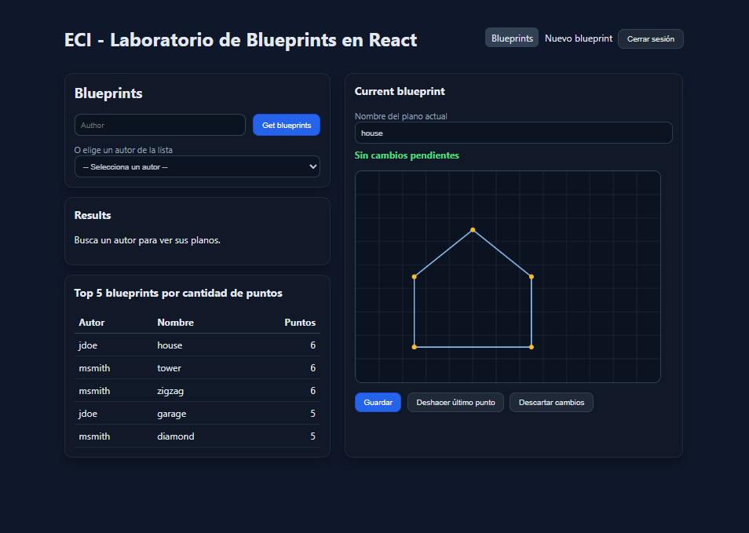

**2. Código relevante de `src/styles.css`:**

<!-- Captura pendiente 5: captura de las clases .card/.btn/.table en src/styles.css -->

### 7. Pruebas unitarias

Vitest + Testing Library cubren el canvas y sus clics, los formularios, el slice (reducers puros y thunks), los flujos completos contra un store real (búsqueda, edición, CRUD con rollback) y los servicios/autenticación por separado. En total quedaron 109 pruebas en 16 archivos, todas en verde (`npm test`).

#### Evidencias:

**1. Ejecución completa de `npm test` en verde:**

<!-- Captura pendiente 6: captura de la consola con el resumen final de `npm test` (Test Files 16 passed, Tests 109 passed) -->

**2. Ejemplo de prueba de interacción con Redux (dispatch de un thunk) y de una prueba de componente:**

<!-- Captura pendiente 7: captura de un test representativo, por ejemplo la prueba "clic en el canvas agrega un punto..." de tests/BlueprintsPage.editing.test.jsx -->

> Basado en el cliente HTML/JS del repo de referencia, este laboratorio moderniza el _frontend_ con **React + Vite**, **Redux Toolkit**, **Axios** (con interceptores y JWT), **React Router** y pruebas con **Vitest + Testing Library**.

## Objetivos de aprendizaje

- Diseñar una SPA en React aplicando **componetización** y **Redux (reducers/slices)**.
- Consumir APIs REST de Blueprints con **Axios** y manejar **estados de carga/errores**.
- Integrar **autenticación JWT** con interceptores y rutas protegidas.
- Aplicar buenas prácticas: estructura de carpetas, `.env`, linters, testing, CI.

## Requisitos previos

- Tener corriendo el backend de Blueprints de los **Labs 3 y 4** (APIs + seguridad).
- Node.js 18+ y npm.

Ver la especificación de glosario clave, consulta las [Definiciones del laboratorio](./DEFINICIONES.md).

## Limitaciones del backend del LAB04 y por qué usamos un mock

El backend del LAB04 es un stub y no lo tocamos desde este repo, pero le falta bastante para un CRUD completo:

- `GET /api/blueprints` sin autor responde `405`, así que no hay forma de listar todo ni de armar un top-5 con datos reales del backend.
- No implementa `PUT` ni `DELETE`, solo `POST`.
- `POST /api/blueprints` recibe un `Map<String, String>` (vía `@RequestBody`), no un JSON con arrays anidados, así que `points` viaja serializado como string o Jackson responde `400`.

`apiClient.js` detecta esos `404`/`405` y los marca como `unsupported` en vez de romper la app (se ve reflejado en los banners "No disponible con este backend"). Y como igual queríamos mostrar el flujo completo que pide el laboratorio —editar, renombrar, eliminar, con optimistic updates y rollback—, seguimos usando `apimock.js`, que sí implementa todo eso en memoria. Con `VITE_USE_MOCK=false` se puede seguir probando todo lo que el LAB04 sí soporta: login, crear blueprints y consultarlos por autor/nombre.

#### Evidencias (contra el backend real del LAB04, `VITE_USE_MOCK=false`):

**1. `GET /api/blueprints` (listar todo) responde `405` — por eso el selector de autores y el top-5 se marcan como "no disponible con este backend":**

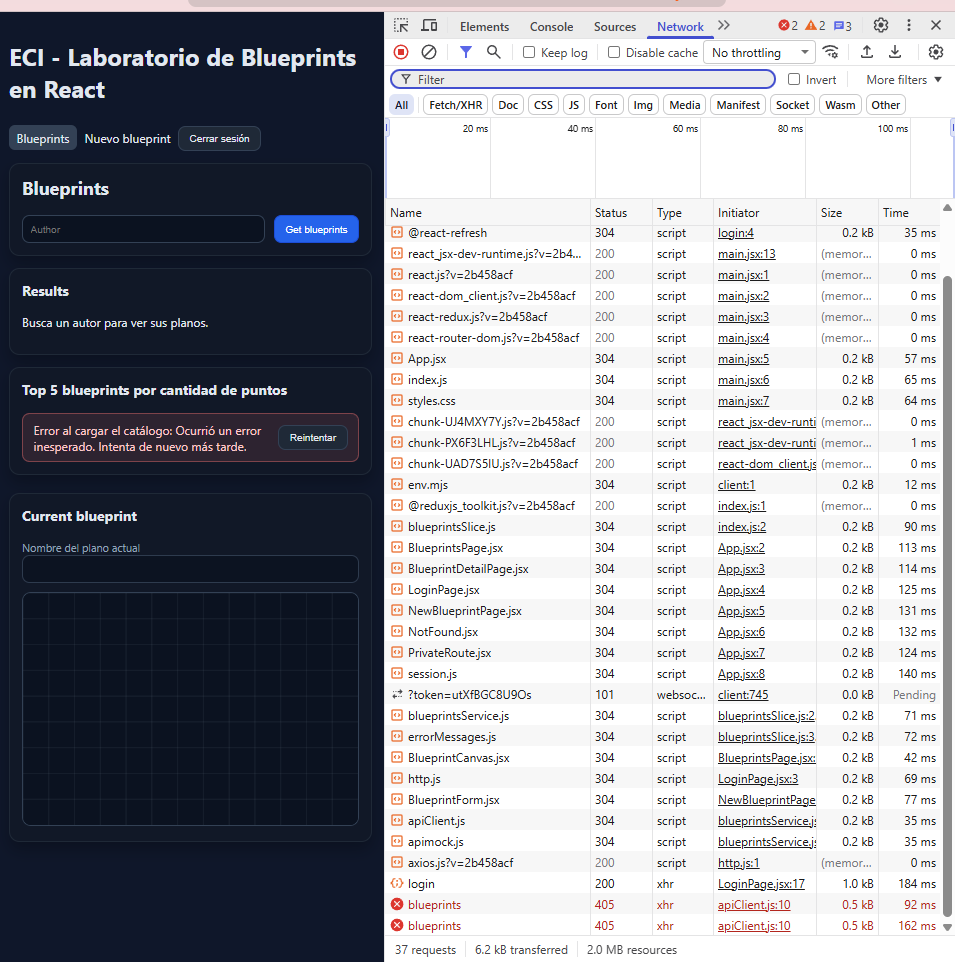

## Endpoints esperados (ajústalos si tu backend quedo diferente)

- `GET /api/blueprints` → lista general o catálogo para derivar autores.
- `GET /api/blueprints/{author}`
- `GET /api/blueprints/{author}/{name}`
- `POST /api/blueprints` (requiere JWT)
- `POST /api/auth/login` → `{ token }`

Configura la URL base en `.env`.

## Cómo ejecutar

### 1. Instalación

```bash
npm install
cp .env.example .env
```

### 2. Opción A — Con datos mock (por defecto, sin backend)

Deja el `.env` tal cual lo copia `.env.example` (`VITE_USE_MOCK=true`) y arranca:

```bash
npm run dev
```

Abre `http://localhost:5173`. Los blueprints y el login viven en memoria del lado del frontend, así que no hace falta tener el backend del LAB04 corriendo para probar nada: buscar, abrir, editar, crear, eliminar.

**Ejemplo, buscando por autor:**

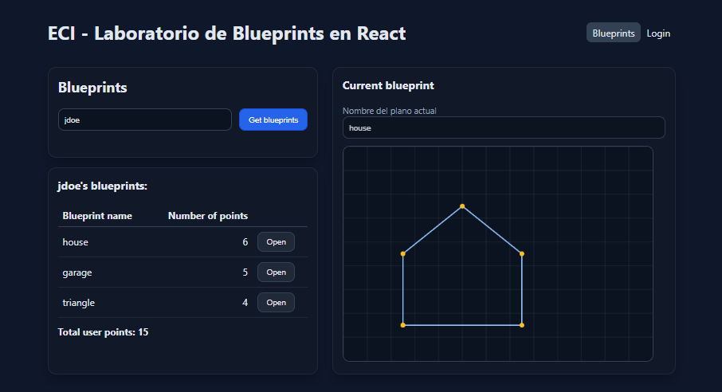

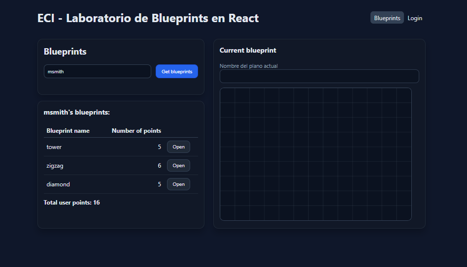

### 3. Opción B — Con el backend real (LAB04)

1. Levanta el backend del LAB04 en `http://localhost:8080` (está fuera de este repo).
2. En `.env`, `VITE_USE_MOCK=false`.
3. Deja `VITE_API_BASE_URL` vacío para usar el proxy de Vite (evita problemas de CORS, ver "Proxy de Vite" más abajo), o apúntalo directo al backend si ya tiene CORS habilitado.
4. `npm run dev` y abre `http://localhost:5173`.

Con el backend real, login y creación funcionan bien, pero editar/eliminar no van a hacer nada porque el LAB04 no tiene `PUT`/`DELETE` (ver [limitaciones del backend del LAB04](#limitaciones-del-backend-del-lab04-y-por-qué-usamos-un-mock)).

### Usuarios de prueba

| Usuario     | Contraseña      | Rol / scope esperado                        | Uso típico en este cliente                                             |
| ----------- | --------------- | -------------------------------------------- | ------------------------------------------------------------------------ |
| `student`   | `student123`    | Usuario estándar (rol de estudiante)         | Login normal, crear/editar/eliminar sus propios blueprints              |
| `assistant` | `assistant123`  | Usuario con privilegios adicionales          | Login con más permisos (según la configuración de seguridad del LAB04)  |

> Son las credenciales de prueba estándar del backend de Blueprints de ARSW. Los scopes exactos los define la configuración de seguridad de tu propio backend del LAB04, revisa su `SecurityConfig` si necesitas el detalle. Con `VITE_USE_MOCK=true`, `authService.js` acepta cualquier usuario/contraseña no vacíos: es solo para poder probar las rutas protegidas sin depender del backend.

#### Evidencia de los scopes contra el backend real (`VITE_USE_MOCK=false`):

**1. `student` autenticado, pero el backend responde `403` al intentar crear un blueprint (sin permisos de escritura):**

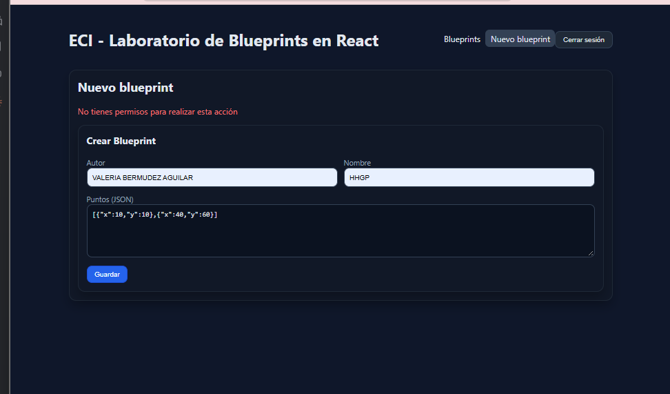

**2. `assistant` autenticado sí puede crear un blueprint contra el mismo backend:**

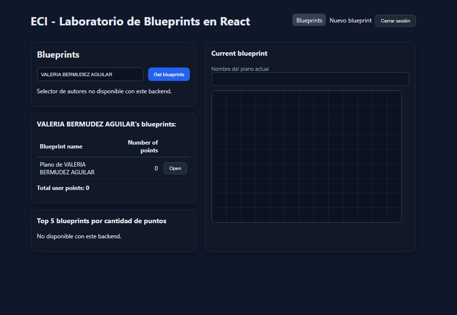

## Variables de entorno

Crea un archivo `.env` en la raíz:

```variable
VITE_API_BASE_URL=http://localhost:8080/api
```

> **Tip:** en producción usa variables seguras o un _reverse proxy_.

## Estructura

```carpetas
blueprints-react-lab/
├─ src/
│  ├─ auth/session.js                  # token en localStorage + hook useAuth
│  ├─ components/
│  │  ├─ BlueprintCanvas.jsx           # canvas 2D (lectura y edición)
│  │  ├─ BlueprintForm.jsx             # formulario de creación + validación
│  │  ├─ BlueprintList.jsx
│  │  ├─ ConfirmDialog.jsx             # modal de confirmación (Eliminar)
│  │  └─ PrivateRoute.jsx
│  ├─ features/blueprints/blueprintsSlice.js
│  ├─ pages/
│  │  ├─ BlueprintsPage.jsx            # página principal (búsqueda, top-5, canvas)
│  │  ├─ BlueprintDetailPage.jsx
│  │  ├─ LoginPage.jsx
│  │  ├─ NewBlueprintPage.jsx
│  │  └─ NotFound.jsx
│  ├─ services/
│  │  ├─ apimock.js                    # datos en memoria (misma interfaz)
│  │  ├─ apiClient.js                  # axios contra el backend real
│  │  ├─ authService.js                # login mock / login real
│  │  ├─ blueprintsService.js          # switch mock/real por VITE_USE_MOCK
│  │  └─ http.js                       # axios + interceptores JWT
│  ├─ utils/errorMessages.js
│  ├─ store/index.js                   # Redux Toolkit
│  ├─ App.jsx, main.jsx, styles.css
├─ tests/                              # Vitest + Testing Library
├─ .github/workflows/ci.yml            # npm ci → lint → test → build
├─ Dockerfile, docker-compose.yml, .dockerignore
├─ index.html, package.json, vite.config.js, README.md
```

## 📌 Requerimientos del laboratorio

## 1. Canvas (lienzo)

- Agregar un lienzo (Canvas) a la página.
- Incluir un componente `BlueprintCanvas` con un identificador propio.
- Definir dimensiones adecuadas (ej. `520×360`) para que no ocupe toda la pantalla pero permita dibujar los planos.

## 2. Listar los planos de un autor

- Permitir ingresar el nombre de un autor y consultar sus planos desde el backend (o mock).
- Mostrar los resultados en una tabla con las siguientes columnas:
  - Nombre del plano
  - Número de puntos
  - Botón `Open` para abrirlo

## 3. Seleccionar un plano y graficarlo

Al hacer clic en el botón `Open`, debe:

- Actualizar un campo de texto con el nombre del plano actual.
- Obtener los puntos del plano correspondiente.
- Dibujar consecutivamente los segmentos de recta en el canvas y marcar cada punto.

## 4. Servicios: `apimock` y `apiclient`

- Implementar dos servicios con la misma interfaz:
  - `apimock`: retorna datos de prueba desde memoria.
  - `apiclient`: consume el API REST real con Axios.
- La interfaz de ambos debe incluir los métodos:
  - `getAll`
  - `getByAuthor`
  - `getByAuthorAndName`
  - `create`
- Habilitar el cambio entre `apimock` y `apiclient` con una sola línea de código:
  - Definir un módulo `blueprintsService.js` que importe uno u otro según una variable en `.env`.
  - Ejemplo en `.env` (Vite):

```env
VITE_USE_MOCK=true
```

- `VITE_USE_MOCK=true` usa el mock.
- `VITE_USE_MOCK=false` usa el API real.

## 5. Interfaz con React

- El nombre del plano actual debe mostrarse en el DOM como parte del estado global (Redux).
- Evitar manipular directamente el DOM; usar componentes y props/estado.

## 6. Estilos

- Agregar estilos para mejorar la presentación.
- Se puede usar Bootstrap u otro framework CSS.
- Ajustar la tabla, botones y tarjetas para acercarse al mock de referencia.

## 7. Pruebas unitarias

- Agregar pruebas con Vitest + Testing Library para validar:
  - Render del canvas.
  - Envío de formularios.
  - Interacciones básicas con Redux (por ejemplo: dispatch de `fetchByAuthor`).

---

### Notas rápidas y recomendaciones

- Para el canvas en tests con jsdom: agregar un mock de `HTMLCanvasElement.prototype.getContext` en `tests/setup.js`.
- Para usar `@testing-library/jest-dom` con Vitest: en `tests/setup.js` importar `import '@testing-library/jest-dom'` y asegurarse de que Vitest provea el global `expect` (configurar `vitest.config.js` con la opción `test: { globals: true, setupFiles: './tests/setup.js' }`).
- Para la conmutación de servicios en Vite, usar `import.meta.env.VITE_USE_MOCK` para leer la variable en tiempo de ejecución.

## 📌 Recomendaciones y actividades sugeridas para el exito del laboratorio

Se hicieron todas, el detalle de cada una está más abajo.

1. **Redux avanzado**
   - [x] Estados `loading/error` por thunk, mostrados en la UI.
   - [x] Memo selector para el top-5 de blueprints.
2. **Rutas protegidas**
   - [x] `<PrivateRoute>` protegiendo la creación/edición.
3. **CRUD completo**
   - [x] `PUT`/`DELETE` en el slice y en la UI.
   - [x] Optimistic updates con rollback si falla.
4. **Dibujo interactivo**
   - [x] Lienzo donde se agregan puntos con clic.
   - [x] Botón "Guardar" que envía el blueprint.
5. **Errores y retry**
   - [x] Banner de error + botón Reintentar por cada thunk.
6. **Testing**
   - [x] Pruebas del `blueprintsSlice` (reducers puros).
   - [x] Pruebas de componentes con Testing Library.
7. **CI/Lint/Format**
   - [x] GitHub Actions con lint + test + build.
8. **Docker (opcional)**
   - [x] `Dockerfile` + `compose` para el frontend.

## Funcionalidades adicionales (Fases 3 a 5)

Esto es lo que se sumó además de los 7 puntos base.

### 8. Estados y errores por thunk (Redux avanzado)

`status` y `error` en el slice son objetos con una entrada por operación (`authors`, `byAuthor`, `current`, `update`, `delete`), no un flag único, así un error al guardar no borra la lista que ya estaba cargada. Cada bloque de la UI tiene su propio banner de error con un botón Reintentar que vuelve a lanzar el mismo thunk. Y cuando el backend responde `405` (no soporta listar todo), el estado queda como `'unsupported'` en vez de `'failed'`, para mostrar un mensaje distinto al de un error real.

#### Evidencias:

**1. Banner de error con botón "Reintentar" en el navegador:**

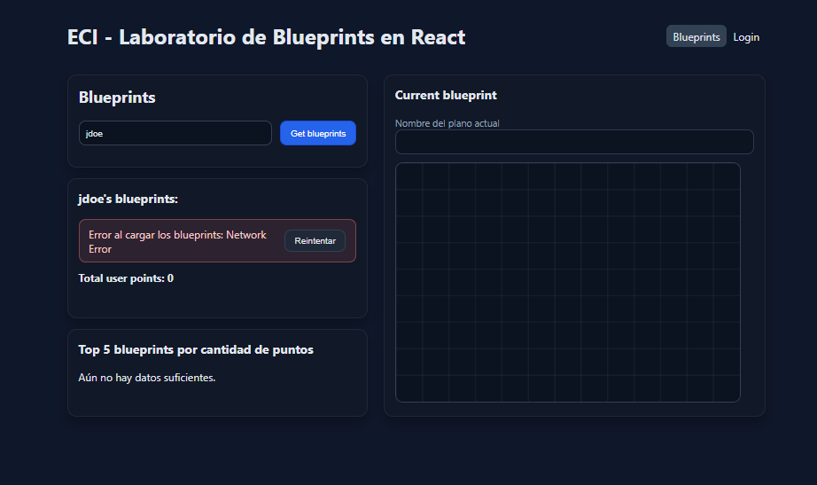

**2. Código de `status`/`error` por thunk en `blueprintsSlice.js`:**

<!-- Captura pendiente 8: captura del initialState y los extraReducers de fetchByAuthor mostrando status/error independientes -->

### 9. Top-5 blueprints por cantidad de puntos (memo selector)

`selectTopBlueprints` usa `createSelector` para ordenar `all` por cantidad de puntos y quedarse con los 5 primeros; se recalcula solo cuando `all` cambia, no en cada render. Se muestra en su propia tabla y cada fila es clickeable para abrir ese blueprint en modo lectura.

#### Evidencias:

**1. Tabla "Top 5 blueprints por cantidad de puntos" en el navegador:**

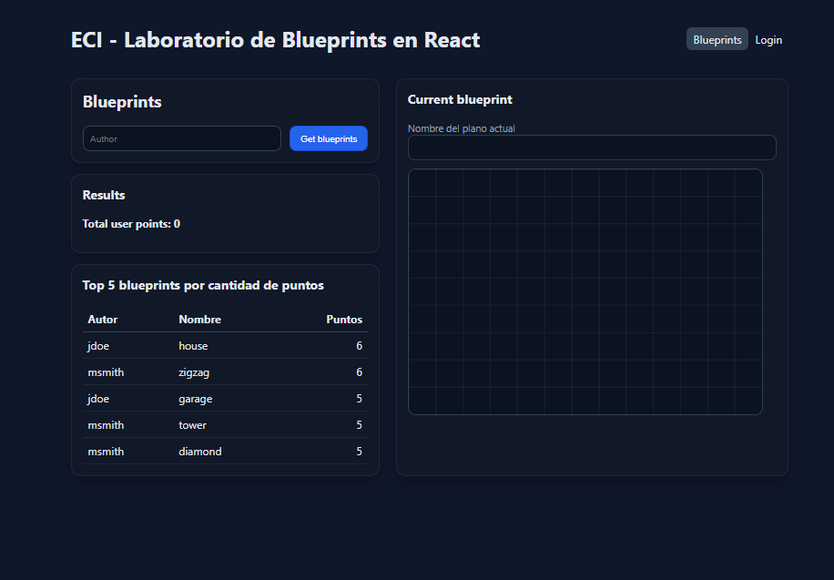

**2. El top-5 se recalcula solo (memo selector) tras guardar cambios — "house" pasa de 6 a 11 puntos y sube en el ranking:**

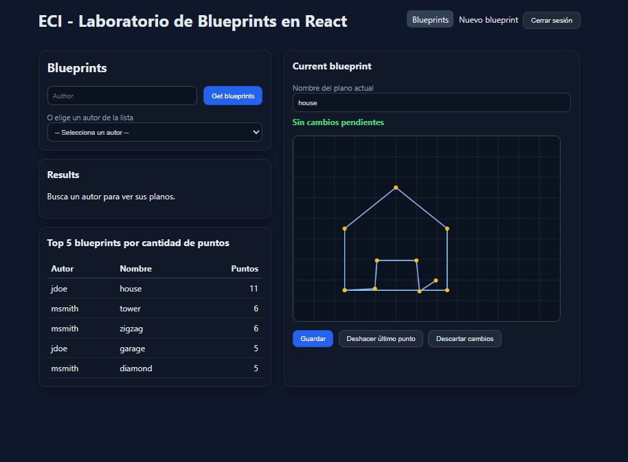

**3. Código del selector `selectTopBlueprints`:**

<!-- Captura pendiente 9: captura de la definición de selectTopBlueprints en blueprintsSlice.js -->

### 10. Selector de autores

Si `fetchAuthors` resuelve bien, aparece un `<select>` con los autores únicos del catálogo. Elegir uno de la lista dispara la misma búsqueda que escribirlo a mano, para no duplicar lógica.

#### Evidencias:

**1. Select de autores en el navegador (se puebla al resolver `fetchAuthors`):**


### 11. Rutas protegidas (`PrivateRoute`) y login/logout

`<PrivateRoute>` revisa si hay token en `localStorage` y, si no, redirige a `/login` guardando de dónde venía para volver después; protege `/blueprints/new`. El header usa `useAuth()` para mostrar Login o Cerrar sesión + Nuevo blueprint según corresponda (se sincroniza entre pestañas con el evento `storage`). Editar y Eliminar en la tabla, y los controles de edición del canvas, también dependen de si hay sesión.

#### Evidencias:

**1. Pantalla de `/login`:**

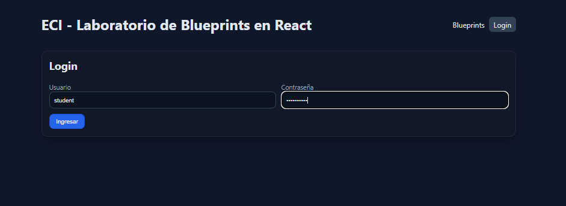

**2. Sin sesión: header con "Login" y tabla con solo el botón `Open` (sin Editar/Eliminar):**

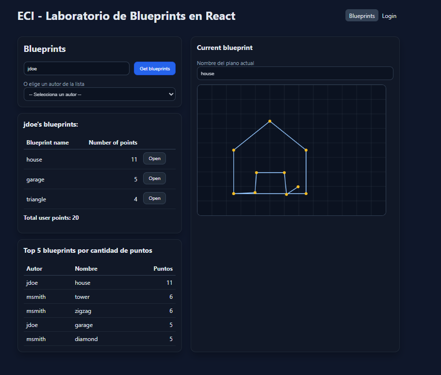

**3. Con sesión: header con "Cerrar sesión" + "Nuevo blueprint":**


### 12. Proxy de Vite hacia el backend real

`vite.config.js` reenvía `/api` y `/auth` a `http://localhost:8080`, así el navegador ve todo como mismo origen y no hay que configurar CORS en el LAB04. Por eso conviene dejar `VITE_API_BASE_URL` vacío en local: Axios manda rutas relativas y Vite las reenvía.

#### Evidencias:

**1. La petición sale a `http://localhost:5173/api/blueprints` (no a `:8080`) y ya trae el header `Authorization: Bearer ...` que agrega el interceptor de Axios:**

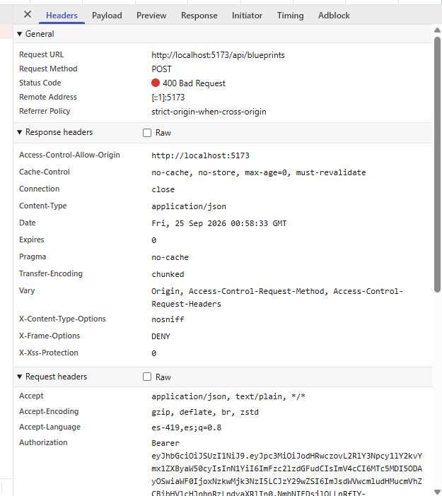

**2. Código de `server.proxy` en `vite.config.js`:**

<!-- Captura pendiente 10: captura del bloque proxy en vite.config.js -->

### 13. Validación del formulario de creación

`BlueprintForm.jsx` valida antes de despachar `createBlueprint`: autor y nombre no vacíos, y que el JSON de puntos sea un arreglo válido. Si algo falla, se muestra el error junto al campo y no se llega a llamar `onSubmit`. Los errores que puede devolver el backend (400 por datos inválidos, 403 por falta de permisos) se traducen a un mensaje legible en `NewBlueprintPage.jsx`.

#### Evidencias:

**1. Formulario mostrando los mensajes de error de validación (campos vacíos o JSON de puntos inválido):**

<!-- Captura pendiente 11: captura del formulario "Crear Blueprint" con errores visibles (campos vacíos o JSON de puntos inválido) -->

**2. Mensaje de error tras un `403` del backend real (usuario `student` sin permisos para crear):**


### 14. CRUD completo con optimistic updates

`updateBlueprint` y `deleteBlueprint` cambian el store de inmediato, antes de que el backend confirme, guardando un snapshot del estado anterior; si la petición falla, el reducer revierte todo a ese snapshot y muestra el error. Eliminar pasa primero por un diálogo de confirmación propio (nada de `window.confirm`). El modo edición también permite renombrar el blueprint reutilizando el mismo thunk de `updateBlueprint` (ver el punto 16).

#### Evidencias:

**1. Rollback visible tras un fallo simulado de guardado (el punto agregado desaparece y se muestra el error):**

<!-- Captura pendiente 12: captura de la prueba o de la consola del navegador mostrando el rollback -->

**2. Diálogo de confirmación de "Eliminar" (no `window.confirm`):**

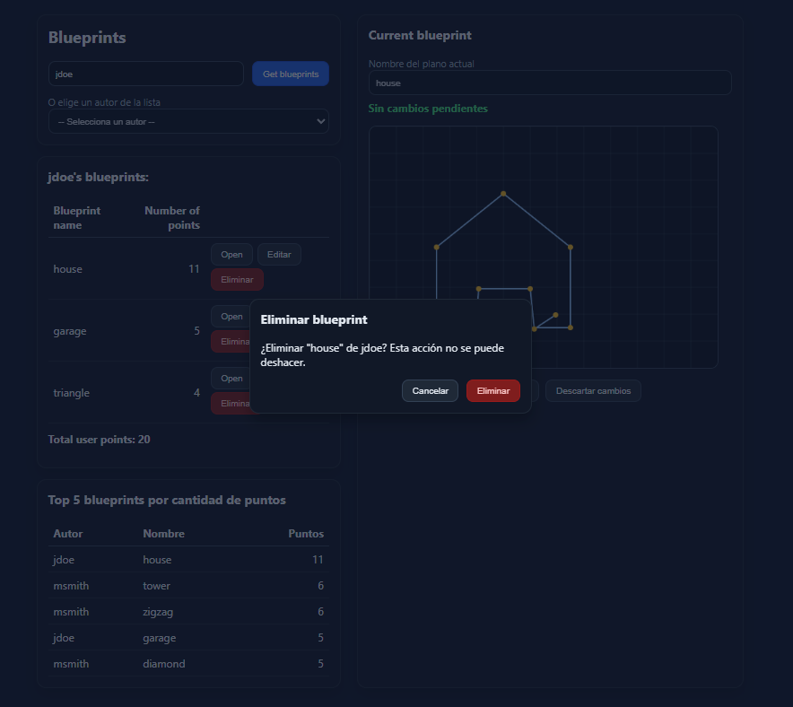

### 15. Dibujo interactivo en el canvas

En modo edición, cada clic en el canvas calcula la coordenada real (hay que compensar el escalado CSS contra las dimensiones internas del `<canvas>`) y agrega un punto al borrador local. Deshacer último punto y Descartar cambios trabajan sobre ese mismo borrador, antes de que se confirme el guardado.

#### Evidencias:

**1. Estado inicial: plano "house" abierto en edición, sin dibujar aún:**


**2. Se agregan puntos por clic; el canvas los conecta y marca "Cambios sin guardar":**

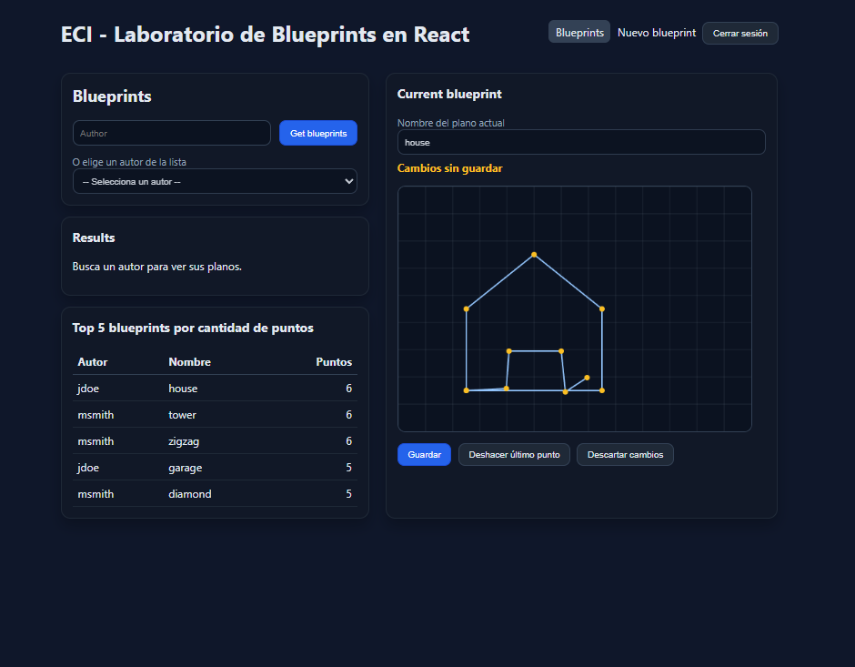

**3. Tras pulsar Guardar: "Sin cambios pendientes" y el top-5 recalculado (house pasa de 6 a 11 puntos):**


### 16. Modos de lectura y edición (Open vs. Editar) — Fase 5

Antes, Open y Editar hacían básicamente lo mismo cuando había sesión iniciada. Ahora `BlueprintsPage.jsx` maneja dos modos explícitos: Open carga el plano en solo lectura (canvas no clickeable, sin botones de Guardar/Deshacer/Descartar, nombre no editable), y Editar (solo aparece con sesión) lo abre en edición: canvas clickeable, esos tres botones visibles, y el campo de nombre se puede editar para renombrar el blueprint junto con los puntos al guardar. El canvas muestra una insignia con el modo activo, y en edición además una pista de que se puede hacer clic para agregar puntos.

También se arregló el layout de la tabla: Open, Editar y Eliminar ahora van dentro de un mismo contenedor con botones más chicos, para que quepan en una sola fila en vez de partirse en dos líneas como antes.

Todo esto tiene pruebas nuevas en `BlueprintsPage.editing.test.jsx` y `BlueprintsPage.test.jsx`.

#### Evidencias:

**1. Antes (Fase 4): Open/Editar/Eliminar partidos en dos líneas dentro de la celda de la tabla:**

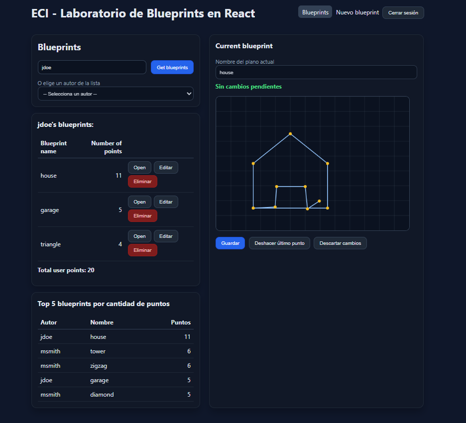

**2. Después (Fase 5): las tres acciones en una sola fila (`.table-actions` + `.btn.sm`):**

<!-- Captura pendiente 13: captura de la tabla ya con Open/Editar/Eliminar compactos en una sola fila -->

**3. Canvas en modo "Solo lectura" tras pulsar Open (insignia visible, sin controles de edición):**

<!-- Captura pendiente 14: captura del canvas + insignia "Modo: Solo lectura" -->

**4. Canvas en modo "Edición" tras pulsar Editar (insignia, campo de nombre editable, botones Guardar/Deshacer/Descartar):**

<!-- Captura pendiente 15: captura del canvas + insignia "Modo: Edición" con los controles visibles -->

**5. Pruebas nuevas de esta fase en verde:**

<!-- Captura pendiente 16: captura de la consola con las pruebas de modo lectura/edición y de la tabla de acciones en verde -->

### 17. Login mock

Con `VITE_USE_MOCK=true`, `authService.js` acepta cualquier usuario/contraseña no vacíos y devuelve un token simulado, así se puede probar `PrivateRoute`, el header con sesión y el modo edición sin necesitar el backend del LAB04 arriba. Con `VITE_USE_MOCK=false`, el login sí pega contra `POST /auth/login` con las [credenciales de prueba](#usuarios-de-prueba).

#### Evidencias:

**1. Login exitoso en modo mock y token guardado en `localStorage`:**

<!-- Captura pendiente 17: captura de DevTools > Application > Local Storage mostrando la clave "token" tras iniciar sesión en modo mock -->

### 18. CI (GitHub Actions)

`ci.yml` corre en cada push/PR: `npm ci`, lint, test y build sobre Node 20. Antes de subir esto se corrió local: lint sin errores, 109/109 pruebas en verde y build sin advertencias.

#### Evidencias:

**1. Ejecución en verde del workflow en la pestaña "Actions" de GitHub:**

<!-- Captura pendiente 18: captura de la pestaña Actions del repo con el workflow "node-ci" en verde -->

### 19. Docker

El `Dockerfile` tiene dos etapas: una compila con Node 20 (`npm run build`) y la otra sirve `dist/` como archivos estáticos con `serve`. Como Vite hornea `VITE_API_BASE_URL`/`VITE_USE_MOCK` en el bundle durante el build (no existen en runtime dentro del contenedor), el Dockerfile los recibe como `ARG` y `docker-compose.yml` los pasa por `build.args`, no por `environment` (que ahí no serviría de nada).

`docker-compose.yml` ya no apunta a la imagen de ejemplo `ghcr.io/your-org/...` que traía: el backend no vive en este repo, así que el compose solo define el servicio `web`, construido desde el Dockerfile local.

#### Cómo se configura la URL del backend al hacer build con Docker

```bash
docker build -t blueprints-react-lab .

docker build \
  --build-arg VITE_USE_MOCK=false \
  --build-arg VITE_API_BASE_URL=http://host.docker.internal:8080/api \
  -t blueprints-react-lab .

docker compose up --build
VITE_USE_MOCK=false VITE_API_BASE_URL=http://host.docker.internal:8080/api docker compose up --build
```

#### Evidencias:

**1. `docker compose up --build` corriendo y la app sirviéndose en `http://localhost:5173`:**

<!-- Captura pendiente 19: captura de la terminal con `docker compose up --build` y del navegador mostrando la app -->

## Criterios de evaluación

- Funcionalidad y cobertura de casos (30%)
- Calidad de código y arquitectura (Redux, componentes, servicios) (25%)
- Manejo de estado, errores, UX (15%)
- Pruebas automatizadas (15%)
- Seguridad (JWT/Interceptores/Rutas protegidas) (10%)
- CI/Lint/Format (5%)

## Scripts

- `npm run dev` – servidor de desarrollo Vite
- `npm run build` – build de producción
- `npm run preview` – previsualizar build
- `npm run lint` – ESLint
- `npm run format` – Prettier
- `npm test` – Vitest

---

### Extensiones propuestas del reto

- **Redux Toolkit Query** para _caching_ de requests.
- **MSW** para _mocks_ sin backend.
- **Dark mode** y diseño responsive.

> Este proyecto es un punto de partida para que tus estudiantes evolucionen el cliente clásico de Blueprints a una SPA moderna con prácticas de la industria.
